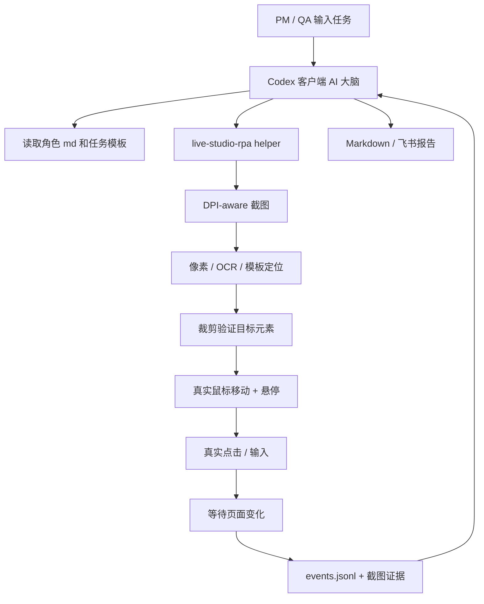

# Live Studio AI Inspector PRD - Codex + DPI-aware RPA MVP

## 一、项目背景与目标

我们是 TikTok Live 产品团队，主要负责桌面端开播工具 TikTok LIVE Studio 的产品工作。Live Studio 作为面向主播和运营侧的桌面工具，功能与场景不断扩展，但上线前验收、端到端回归和探索性体验仍高度依赖人工操作。尤其在“首次开播配置 -> 开播 -> 直播中调整 -> 复盘”这类跨页面流程中，人工验证容易遗漏 UI 细节、加载反馈、异常提示、文案理解成本等体验问题。

我们希望通过 AI 提效这类工作：让 AI 代入专业测试专家、萌新秀场主播、萌新游戏主播等角色，在真实 Live Studio 客户端中执行指定任务，观察操作过程，记录体验问题，并生成结构化产品体验/验收报告。

前一版方案重点考虑通过 Codex Computer Use 或 OpenAI Computer Use API 操作桌面应用。但验证发现：Codex Computer Use 能够启动并观察 Live Studio 窗口，却无法稳定向 Live Studio 的 Electron 自绘页面注入点击和键盘事件；OpenAI API Computer Use 虽更产品化，但 API 费用不符合当前验证阶段预算。因此本 PRD 调整为更务实的 MVP 方案：

- 以 Codex 客户端作为 AI 大脑，负责读取角色、理解任务、观察结果、归纳体验问题、生成报告。
- 以本地 DPI-aware 视觉 RPA helper 作为操作执行器，负责真实截图、像素定位、移动鼠标、点击、输入和等待页面变化。
- 优先复用内部测试同学在 ByteIO 埋点验证 skill 中沉淀的桌面自动化经验：DPI-aware 截图、像素分析定位、裁剪验证、显式移动鼠标悬停、真实点击。
- 本期不优先开发完整 exe 和复杂 GUI，而是先完成可在 Codex 中编排的 MVP 工作流，验证 AI 是否能稳定完成开播流程并产出有效体验报告。

### 1.1 核心目标

| 目标 | 说明 | 成功标准 |
| --- | --- | --- |
| 跑通真实开播链路 | 从启动 Live Studio 到完成一次开播 | 至少在测试账号/安全环境中完成 1 条开播路径 |
| 让 AI 形成体验判断 | 不只执行点击，还要总结卡顿、文案、入口、异常提示等问题 | 报告中包含可复核的问题、步骤和证据 |
| 降低使用成本 | 不走 OpenAI API 账单，优先使用 Codex 客户端订阅能力 | 日常使用成本不随 API token 放大 |
| 沉淀可复用工作流 | 用角色 md、任务 prompt、RPA helper 命令沉淀流程 | PM 可通过模板复用并发起新任务 |

### 1.2 本期产品定位

本期不是面向普通主播的产品功能，也不是完整测试平台，而是 Live Studio PM/QA 内部使用的 AI 验收工作流。它的重点是验证“AI + 真实桌面操作 + 结构化报告”是否能有效发现产品功能缺陷和体验问题。

---

## 二、方案演进与结论

### 2.1 已验证方案对比

| 方案 | 操作方式 | 优点 | 问题 | 本期结论 |
| --- | --- | --- | --- | --- |
| Codex Computer Use 直连 Live Studio | Codex 截图 + Computer Use 点击窗口 | 无需开发；可观察窗口 | 当前可观察但点击/键盘无法被 Live Studio Electron 页面稳定接收 | 不作为主执行器 |
| OpenAI API Computer Use | Responses API 返回动作，本地执行并回传截图 | 产品化能力清晰；适合长期工具化 | API 独立计费，成本当前不可接受 | 暂不采用 |
| Electron CDP / Playwright | 通过 remote debugging 操作 DOM | 最稳定，可获取页面状态和 selector | 需要 Live Studio 内部包支持调试端口或自动化桥 | 作为后续增强 |
| DPI-aware 视觉 RPA | 真实截图、像素定位、移动鼠标、点击 | 接近人工真实操作；不依赖 UIA/DOM；已有内部经验可借鉴 | 对视觉变化敏感，需要精心封装 | 本期主方案 |

### 2.2 关键判断

Codex Computer Use 的失败点并不代表 AI 体验方案不可行，而是说明 Live Studio Electron 页面不适合完全依赖通用窗口自动化注入。内部 ByteIO skill 中的经验表明，Live Studio 这类桌面应用更适合使用真实桌面级 RPA：先截图并定位按钮，再移动真实鼠标到按钮中心，停留确认 hover/focus，最后点击。

因此本期方案调整为：

```text
Codex 客户端
  -> 读取角色 md / 任务 prompt
  -> 决策下一步体验动作
  -> 调用本地 live-studio-rpa helper
  -> helper 执行真实截图、定位、鼠标移动、点击、输入
  -> 返回截图、耗时、页面变化、失败原因
  -> Codex 继续判断体验问题并生成报告
```

---

## 三、整体方案

### 3.1 系统角色

| 角色/模块 | 职责 |
| --- | --- |
| PM / QA 用户 | 提供任务描述、选择角色、确认安全账号和测试环境 |
| Codex 客户端 | AI 大脑，负责理解任务、调用 helper、观察截图、总结体验问题 |
| 角色 md | 定义体验视角，如专业测试专家、萌新游戏主播、萌新秀场主播 |
| live-studio-rpa helper | 本地操作执行器，负责启动应用、截图、找按钮、移动鼠标、点击、输入、等待 |
| 日志与报告模块 | 保存操作轨迹、关键截图、耗时指标，并生成 Markdown/飞书报告 |

### 3.2 MVP 工作流

1. 用户在 Codex 中发起任务，例如：“读取 `roles/new_game_streamer.md`，以萌新游戏主播身份完成一次游戏开播体验，并生成报告”。
2. Codex 读取角色 md、任务模板和 checklist。
3. Codex 调用 `live-studio-rpa launch` 启动 Live Studio。
4. helper 执行 DPI-aware 截图，返回当前首页截图和窗口状态。
5. Codex 观察画面，判断下一步需要点击 `Go LIVE`。
6. Codex 调用 `live-studio-rpa click-button --label "Go LIVE" --color pink`。
7. helper 通过截图/像素定位按钮，裁剪验证按钮区域，移动真实鼠标到中心，停留 500ms，执行点击。
8. helper 等待页面变化，返回点击前后截图和耗时。
9. Codex 根据页面变化继续推进开播配置、信息填写、权限弹窗、最终开播。
10. 任务结束后，Codex 汇总 `events.jsonl`、关键截图和体验观察，生成 Markdown 报告。
11. 可选：调用飞书 CLI 创建飞书文档。

### 3.3 架构示意



---

## 四、核心能力设计

### 4.1 F1 角色与任务输入

#### 需求说明

用户通过 Codex 线程发起任务，不需要独立 GUI。任务由自然语言描述、角色 md、执行边界和报告要求组成。

#### 角色文件

| 角色文件 | 角色定位 | 关注重点 |
| --- | --- | --- |
| `roles/pro_qa.md` | 专业软件测试专家 | 功能正确性、异常态、边界条件、复现路径 |
| `roles/new_show_streamer.md` | 萌新秀场主播 | 新手理解成本、开播引导、标题/封面/摄像头配置 |
| `roles/new_game_streamer.md` | 萌新游戏主播 | 游戏源选择、画面预览、性能提示、开播信心 |
| `roles/senior_streamer.md` | 资深主播 | 效率、快捷入口、多场景切换、直播中调整 |

#### 推荐任务 Prompt

```md
请读取 roles/new_game_streamer.md，并以该角色体验 TikTok LIVE Studio。

任务：从启动 Live Studio 到完成一次真实游戏开播。

执行要求：
- 使用 live-studio-rpa helper 操作 Live Studio，不直接依赖 Computer Use 点击。
- 每次点击前必须截图定位、裁剪验证、移动真实鼠标并停留，再点击。
- 记录关键操作、等待时长、页面变化和体验问题。
- 遇到加载等待超过 3 秒记录观察点；超过 8 秒判断是否构成体验问题。
- 允许使用安全测试账号真实开播。

输出：生成 Markdown 产品体验报告。
```

---

### 4.2 F2 live-studio-rpa helper

#### 能力定义

`live-studio-rpa` 是本地命令行 helper，作为 Codex 可调用的“手脚”。它不负责产品判断，只负责可靠执行桌面操作，并把观察结果结构化返回。

#### 命令设计

| 命令 | 说明 | 输出 |
| --- | --- | --- |
| `live-studio-rpa launch` | 启动 Live Studio | 进程状态、窗口信息 |
| `live-studio-rpa screenshot` | DPI-aware 全屏/窗口截图 | 图片路径、尺寸、DPI 信息 |
| `live-studio-rpa locate --label "Go LIVE"` | 定位目标文字/按钮 | 候选区域、置信度、裁剪图 |
| `live-studio-rpa click-button --label "Go LIVE" --color pink` | 定位并点击按钮 | 点击坐标、前后截图、耗时 |
| `live-studio-rpa paste --label "Title" --text "Test live"` | 定位输入框并粘贴文本 | 输入结果、截图 |
| `live-studio-rpa wait-change --timeout 8` | 等待页面视觉变化 | 是否变化、耗时、截图差异 |
| `live-studio-rpa status` | 检测当前页面状态 | 状态摘要、可见关键文本 |

#### 返回格式

每个命令统一返回 JSON，便于 Codex 读取：

```json
{
  "ok": true,
  "action": "click-button",
  "label": "Go LIVE",
  "center": {"x": 176, "y": 265},
  "before_screenshot": "runs/xxx/screenshots/step_003_before.png",
  "verify_crop": "runs/xxx/screenshots/step_003_crop.png",
  "after_screenshot": "runs/xxx/screenshots/step_003_after.png",
  "duration_ms": 1840,
  "visual_changed": true,
  "notes": "Button found by pink color cluster and crop verified."
}
```

---

### 4.3 F3 DPI-aware 截图与点击策略

#### 核心原则

本模块直接复用内部 ByteIO skill 的经验：

1. 每次 shell 调用都初始化 DPI-aware。
2. 每次点击前重新截图，不复用旧坐标。
3. 通过像素/颜色/OCR 定位目标元素。
4. 点击前必须裁剪验证目标区域。
5. 必须显式移动真实鼠标到目标中心，并停留 500ms。
6. 最后执行真实鼠标点击。
7. 点击后截图并判断页面是否变化。

#### 点击流程

```text
截图 -> 定位候选按钮 -> 裁剪验证 -> 移动鼠标 -> 悬停 500ms -> 点击 -> 等待变化 -> 再截图 -> 返回结果
```

#### 技术实现要点

| 能力 | 实现方式 |
| --- | --- |
| DPI 对齐 | `SetProcessDPIAware()` |
| 截图 | `System.Drawing.CopyFromScreen` 或 Python `mss` |
| 鼠标移动 | Windows `SetCursorPos` |
| 鼠标点击 | `mouse_event` 或 `SendInput` |
| 文本输入 | 剪贴板粘贴，避免中文 IME 干扰 |
| 按钮定位 | 颜色聚类、模板匹配、OCR、关键区域裁剪 |
| 页面变化判断 | 截图差异、关键文本出现、目标颜色/布局变化 |

#### Go LIVE 按钮定位示例

`Go LIVE` 首页按钮是高饱和粉色，可先用颜色聚类定位：

```text
R > 200
G < 80
B > 100
候选区域面积足够大
候选区域宽高比接近按钮形态
裁剪区域包含 Go LIVE 文案或箭头
```

---

### 4.4 F4 体验问题判断

AI 不只是点击工具，还需要从角色视角判断体验问题。本期重点覆盖以下问题类型：

| 问题类型 | 判断信号 | 报告表达 |
| --- | --- | --- |
| 入口不清晰 | 角色不知道下一步点哪里；入口弱于其他内容 | “新手主播可能无法立即理解主入口” |
| 加载反馈弱 | 点击后 3 秒以上无视觉变化或无 loading 文案 | “点击后缺少及时反馈” |
| 加载过长 | 目标页面出现超过 8 秒 | “进入配置页等待时间过长” |
| 文案难懂 | 提示语对新手角色不可理解 | “提示依赖内部术语” |
| 操作无响应 | 点击后无变化，重试仍无变化 | “疑似按钮无响应或点击反馈缺失” |
| 权限/登录阻塞 | 摄像头、麦克风、账号状态阻塞流程 | “阻塞开播，但指引不足” |
| 高风险确认不足 | 最终开播动作缺少上下文确认或状态说明 | “用户不确定是否已经正式开播” |

#### 加载耗时判断

不强制全程录屏，通过 helper 的时间戳和截图序列即可判断大多数加载体验：

```text
点击时间 t0
首次视觉变化 t1
loading 出现 t2
目标页面可见 t3
目标按钮可交互 t4

time_to_first_visual_change = t1 - t0
time_to_target_visible = t3 - t0
time_to_interactive = t4 - t0
```

### 4.5 F5 日志与报告

#### 日志结构

每一步写入 `events.jsonl`：

```json
{
  "step": 5,
  "timestamp": "2026-06-03T20:30:00+08:00",
  "role": "new_game_streamer",
  "intent": "点击 Go LIVE 进入开播配置页",
  "helper_command": "live-studio-rpa click-button --label \"Go LIVE\" --color pink",
  "result": "success",
  "duration_ms": 1840,
  "before_screenshot": "screenshots/step_005_before.png",
  "after_screenshot": "screenshots/step_005_after.png",
  "observation": "点击后 1.8 秒进入配置页，反馈可接受",
  "issue": null
}
```

#### 报告结构

最终报告包含：

1. 任务概览
2. 角色视角
3. 执行路径时间线
4. 体验问题总览
5. 逐项问题详情
6. 关键截图与证据
7. 未覆盖场景与风险
8. 优化建议

---

## 五、产品交互设计

### 5.1 MVP 形态：Codex 工作流包

本期不开发完整 GUI。交互入口为 Codex 线程 + 本地目录结构：

```text
live-studio-ai-inspector/
  roles/
    pro_qa.md
    new_show_streamer.md
    new_game_streamer.md
    senior_streamer.md
  prompts/
    live_studio_acceptance.md
    live_studio_experience.md
  checklists/
    first_live.md
    game_live.md
    show_live.md
  tools/
    live-studio-rpa.ps1
  runs/
    <run-id>/
      events.jsonl
      report.md
      screenshots/
```

### 5.2 用户操作流程

| 阶段 | 用户看到/执行 | 系统行为 |
| --- | --- | --- |
| 准备 | 用户打开 Codex，输入任务 prompt | Codex 读取角色和 checklist |
| 启动 | 用户确认使用安全账号真实开播 | Codex 调用 helper 启动 Live Studio |
| 执行 | Codex 输出当前步骤与观察 | helper 截图、定位、点击、等待 |
| 协助 | 如遇账号/权限/异常弹窗，Codex提示 | 用户可人工处理后让 Codex 继续 |
| 完成 | Codex 输出报告链接/本地路径 | 写入 `report.md`，可选创建飞书文档 |

### 5.3 Codex 过程输出样式

```text
[Step 1] 启动 Live Studio：成功，用时 7.2s
[Step 2] 定位 Go LIVE：成功，裁剪验证通过
[Step 3] 点击 Go LIVE：成功，1.8s 后进入开播配置页
[Step 4] 观察配置页：发现标题输入框和分类选择
[Issue] 新手视角：开播分类说明偏弱，可能不知道如何选择
```

### 5.4 未来轻 GUI 形态

如果 MVP 验证有效，再考虑做轻 GUI：

| 区域 | 功能 |
| --- | --- |
| 任务输入区 | 任务描述、角色选择、是否真实开播 |
| 环境检测区 | Live Studio、Codex、lark-cli、DPI 状态 |
| 执行日志区 | 当前步骤、截图缩略图、问题列表 |
| 报告区 | 本地 Markdown、飞书文档链接 |

---

## 六、边界 Case 与处理策略

| 边界 Case | 影响 | 处理策略 |
| --- | --- | --- |
| Live Studio 未安装 | 无法启动 | helper 返回安装缺失，报告中止原因 |
| Live Studio 已打开但被遮挡 | 点击可能点到错误窗口 | 通过任务栏激活或要求用户前置窗口；重新截图验证 |
| DPI 缩放导致坐标偏移 | 点击偏移 | 每次执行初始化 DPI-aware，并使用物理像素截图 |
| 目标按钮颜色变化 | 找不到按钮 | 降级到 OCR/模板匹配，并输出需更新定位规则 |
| 页面加载过慢 | 任务耗时增加 | 记录加载时间，超过阈值生成体验问题 |
| 权限弹窗 | 阻塞开播 | 若为摄像头/麦克风权限，用户已预授权则可点击；否则提示人工处理 |
| 登录/验证码 | AI 不应处理凭证 | 暂停并请求用户完成 |
| 最终开播按钮找不到 | 无法完成闭环 | 记录当前截图和阻塞步骤，生成部分报告 |
| 误点击 | 影响流程 | 每次点击前裁剪验证，点击后校验页面变化 |
| 直播已开启 | 任务进入直播中状态 | 识别工作台状态并记录开播成功 |

---

## 七、验收标准

### 7.1 MVP 功能验收

| 验收项 | 标准 |
| --- | --- |
| 启动 Live Studio | helper 能从已知路径启动客户端 |
| 首页识别 | 能截图并定位 `Go LIVE` 按钮 |
| 真实点击 | 鼠标可见移动到按钮中心并触发页面变化 |
| 开播流程推进 | 能进入开播配置页并继续关键步骤 |
| 日志生成 | 每一步有事件日志和关键截图 |
| 报告生成 | 能生成结构化 Markdown 报告 |
| 体验判断 | 报告至少包含入口、加载、文案、阻塞类问题判断 |

### 7.2 质量验收

- 不直接复用旧坐标点击。
- 每次点击前必须有截图定位和裁剪验证。
- 点击失败必须返回原因和截图，而不是静默重试。
- 报告中的每个问题必须能追溯到步骤、截图或耗时证据。
- 任务中断时仍能生成部分报告。

---

## 八、里程碑

| 阶段 | 范围 | 产出 |
| --- | --- | --- |
| P0：技术验证 | 启动 Live Studio、截图、定位 Go LIVE、真实点击 | 验证脚本、截图证据 |
| P1：开播主链路 | 进入配置页、填写必要信息、点击最终开播 | 可跑通的一条开播流程 |
| P2：Codex 工作流 | 角色 md、任务 prompt、checklist、日志报告 | 可复用工作流包 |
| P3：体验报告增强 | 问题分类、耗时指标、截图证据、建议模板 | 标准化报告模板 |
| P4：轻工具化 | 可选 GUI、飞书上传、任务历史 | 内部小范围试用工具 |

---

## 九、风险与后续演进

### 9.1 已知风险

| 风险 | 说明 | 缓解 |
| --- | --- | --- |
| 视觉 RPA 脆弱 | UI 改版会影响颜色/模板定位 | 保持定位规则可配置，失败时输出裁剪图 |
| 多屏/DPI 差异 | 不同设备点击偏移 | 强制 DPI-aware，并记录屏幕参数 |
| Codex 过程不可完全结构化 | Codex 是交互式大脑，不是后台服务 | 用固定 prompt 和 helper JSON 输出约束 |
| 真实开播有副作用 | 会产生真实直播状态 | 使用安全账号和测试环境 |
| 部分页面需要人工 | 登录、验证码、权限弹窗可能阻塞 | 明确 human-in-the-loop 策略 |

### 9.2 后续演进

如果 MVP 证明有效，优先推进以下方向：

1. 与 Live Studio Electron 侧合作开放 CDP/Playwright 或内部 automation bridge。
2. 给关键控件补充 `data-testid`、aria label 或自动化 id。
3. 将 helper 从 PowerShell 原型升级为 Python/Go CLI。
4. 支持飞书文档自动生成和截图上传。
5. 沉淀多角色、多流程、多版本回归任务。

---

## 十、结论

本 PRD 建议将 Live Studio AI Inspector 的本期方案从“开发完整 exe 工具”调整为“Codex 工作流 + DPI-aware 真实鼠标视觉 RPA helper”。该方案充分利用 Codex 客户端作为低成本 AI 大脑，同时借鉴内部测试同学已验证过的桌面自动化方法，绕开 Codex Computer Use 在 Live Studio Electron 页面上的输入注入限制。

本期最重要的验证不是 GUI 完整度，而是：AI 能否在真实 Live Studio 中完成开播流程、记录过程证据，并产出对 PM 有价值的体验问题报告。只要 P0/P1 跑通，就可以快速进入 5-10 次真实任务实验，再决定是否继续工具化。
